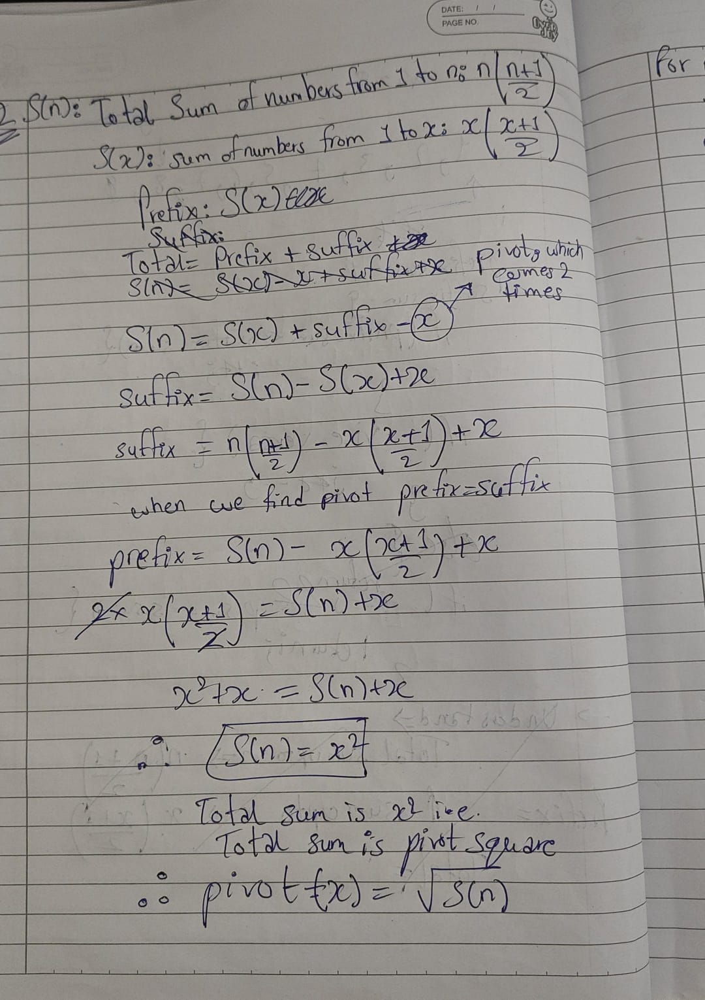

# 2-find-pivot

**Link:** [LeetCode](https://leetcode.com/problems/find-the-pivot-integer/description/?envType=problem-list-v2&envId=maths-m1-arithmetic-basic-reasoning)  
**Difficulty:** Easy

## Approach
First applied two pointer with prefix and suffix sum, then understood about the key concept applied, which is to calculate the total sum upto n with the help of formula and use it to solve the equation.

---

**Time Complexity:** O(1)  
**Space Complexity:** O(1)

## Key Learning
Complex Problem can be solved easily, just need to understand the underlying concept. In this problem, after solving the equation, the pivot element is the square root of the sum of numbers from 1 to n. Formula: n*(n + 1)/2.