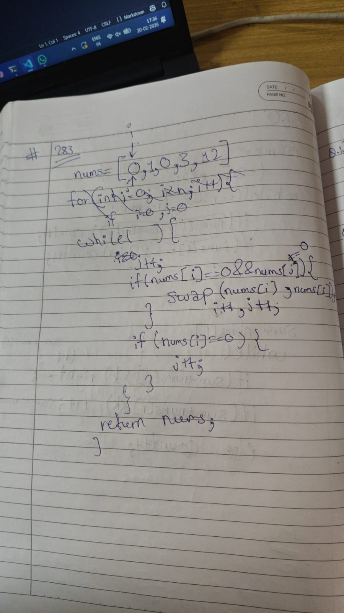

# 243 Moving Zeroes

**Link:** [LeetCode](https://leetcode.com/problems/move-zeroes/description/)  
**Difficulty:** Easy

## Approach
I have used and learnt two pointer approach with it's variation called fast and slow pointers.

---

**Time Complexity:** O(N)  
**Space Complexity:** O(1)

## Key Learning
Understanded the invariant and analysed how annd when the each pointer should move.