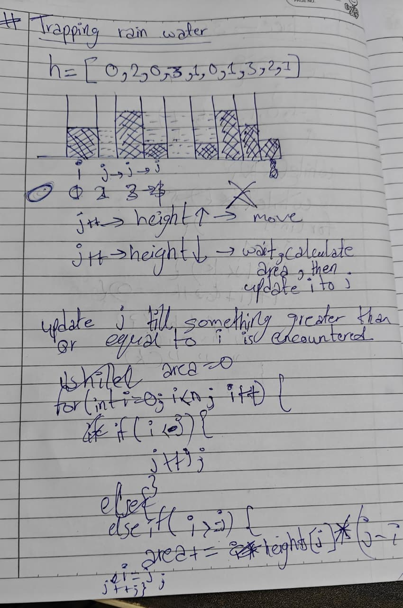
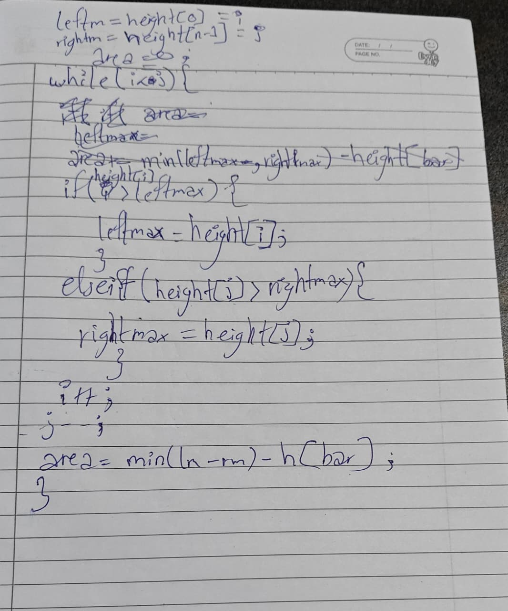

# 42 Trapping Rainwater

**Link:** [LeetCode](https://leetcode.com/problems/trapping-rain-water/description/)  
**Difficulty:** Hard

## Approach
We need to look at it from different pov. I was last time commign solving the maximum water problem. Here we need to think, per block, not as a whole. We cannot just run two opposite pointers towards each other and calculate the area, as some hard blocks will need to be substracted from the total area. So we first take two vars, left max and right max which are maximum height blocks on there respective sides. And intiialise two opposite pointers. Now these pointers will move inward and update the leftmax and rightmax and area per block will be equal to min(leftmax, rightmax) * height[i or j], i or j will be selected per iteration for the area calculation as the smaller one between leftmax or rightmax will choose. Accoridngly only i or only j will be updated.

---

**Time Complexity:** O(n)  
**Space Complexity:** O(n)

## Key Learning
Pattern Recogniton and looking it from different pov.

## Mistakes
Just come to this after solving maximum rainwater problem, so the mindset was to calculate the whole area and substract the hard block area later.
Not using leftmax and rightmax variables, doing all the work usig moving pointers only.
Getting confused between i and height[i], silly mistake, but getting problem. 
Making the pointer move from start and start + 1, and jumping i directly to j after calculating the area, but later understood, to use either j or i, for that particular iteration on the smaller side.
