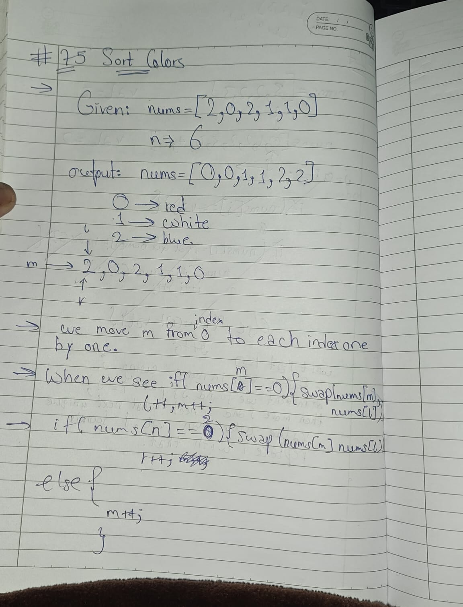

# 75 Sort Colors

**Link:** [LeetCode](https://leetcode.com/problems/sort-colors/)  
**Difficulty:** Medium

## Approach
We can do this problem by sorting but it makes the time complexity O(nlogn), but if user wants to do it in O(n), user has to manipulate the array in place, by dividing the whole array inn 3 parts. one for red(0), one for white(1) and last for blue(2). So, we define three pointers, which divides the array into 4 section, one for 0, one for 1, one for portion left for parsing and one for 2. 

---

**Time Complexity:** O(N)  
**Space Complexity:** O(1)

## Key Learning
Dutch National Flag Algorithm
