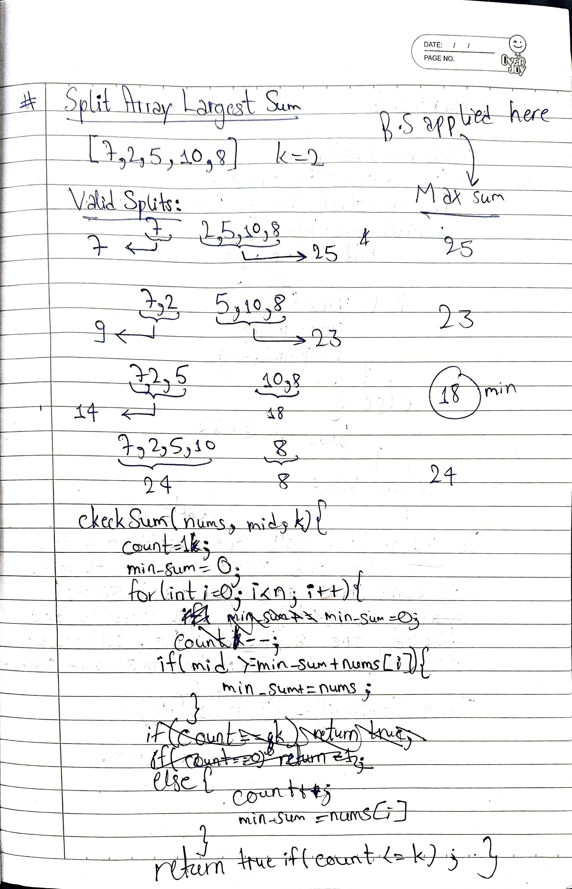
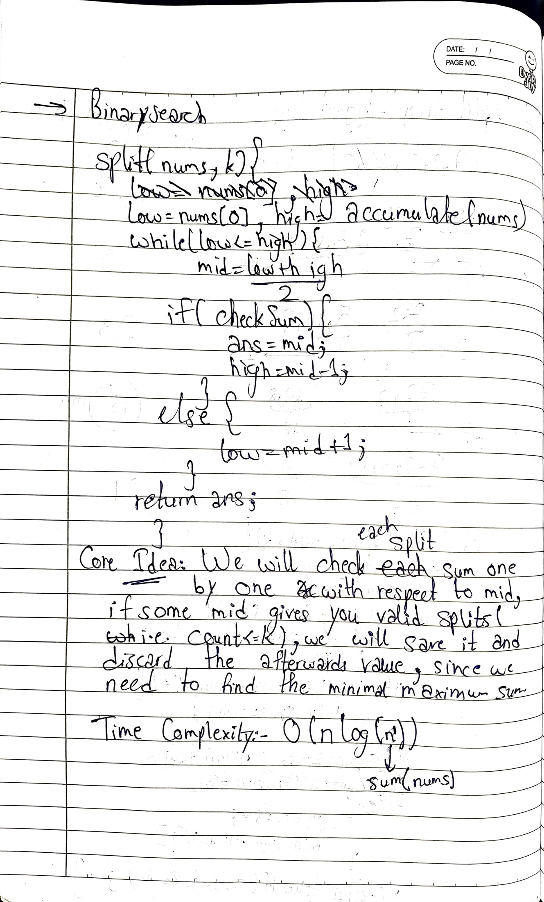

/*
# 410. Split Array Largest Sum

**Link:** https://leetcode.com/problems/split-array-largest-sum/  
**Difficulty:** Hard

## Approach
Binary Search on the answer (minimum possible maximum subarray sum) with a greedy feasibility check.

---
ES
**Time Complexity:** O(n log(Sum(nums)))  
**Space Complexity:** O(1)

## Key Learning
When a problem asks to minimize the maximum value, think Binary Search on the answer combined with a greedy validation.
*/
