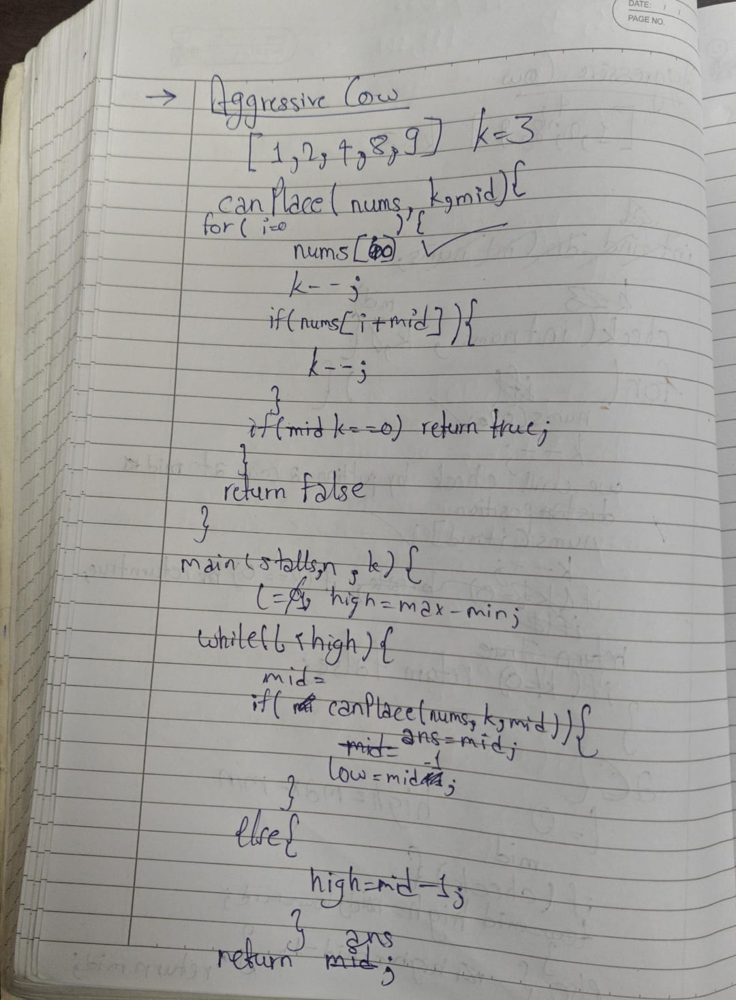

# Aggressive Cows Problem GFG

**Link:** [Aggressive Cows - GeeksforGeeks](https://www.geeksforgeeks.org/problems/aggressive-cows/0)  
**Difficulty:** Medium

## Approach
Binary search on the answer (minimum distance) combined with greedy placement to maximize the minimum distance between any two cows.

---

**Time Complexity:** O(N log N + N log(max - min))  
**Space Complexity:** O(1)

## Key Learning
Binary Search on Answer pattern: When you need to find an optimal value from a range and can verify if a value works, binary search on the answer space. The greedy approach of placing cows at the first valid position ensures maximum space for remaining cows.