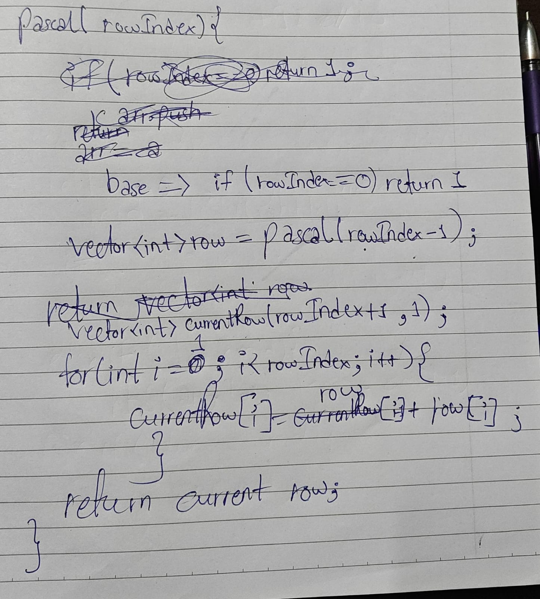

# 119 Pascal triagnle ii

**Link:** [LeetCode](https://leetcode.com/problems/pascals-triangle-ii/)  
**Difficulty:** Easy

## Approach
Used Induction-Base-Hypothesis method by defining the base first, then hypothesis, which is I need to have (rowIndex - 1)th row to
get the (rowIndex)th row. And then comes the final induction in which the logic is putted, which was, when we do the sum of two numbers consecutively from i = 1 to (rowIndex - 1)th element, then we get the next row. We save these value in a new vector instantiated by 1, so that extreme left and right values can be 1 only.

---

**Time Complexity:** O(N^2)  
**Space Complexity:** O(N)

## Key Learning
The biggest trap in recursion is assuming that Space Complexity is equal to the total number of operations. It is not. Space complexity is strictly determined by the maximum depth of the call stack at any given millisecond.Think of the call stack like a lung breathing in and out:Breathing In: As you dive down toward the base case, the computer opens up stack frames and stores variables. The memory footprint grows.Maximum Capacity: The exact moment you hit if (rowIndex == 0), the stack is at its deepest. This is your Space Complexity. For Pascal's Triangle, this was O(k).Breathing Out: As the IOUs are cashed in and the code returns up the chain, those stack frames are destroyed. The memory used for the $k=0$ row is completely wiped clean before the k=1 row finishes its work.