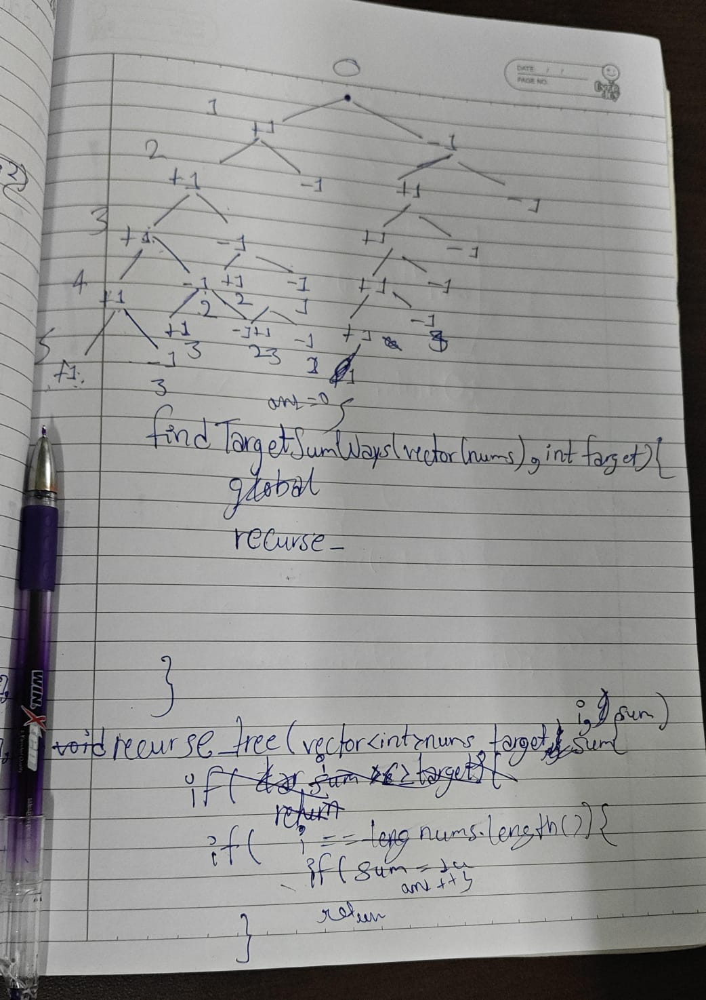

# 494 Target Sum

**Link:** [LeetCode](https://leetcode.com/problems/target-sum/)  
**Difficulty:** Medium

## Approach
Solved this problem with first recursion and then backtracking. We have to make a recursive tree and apply the concept of take and not take. Our final node results will be the answers, so when we get the leaf node sum as equal to target, then we increase the counter, and at last, return it.

---

**Time Complexity:** O(2^N)  # level one: 2 split, level 2: 4 split, level 3: 8 split.............
**Space Complexity:** O(N) # for call stack

## Key Learning
Recursive tree is significant to build as through tree we caan track the recursive calls and decide which parameters to pass in the recursive function so that, one can move left or right. 