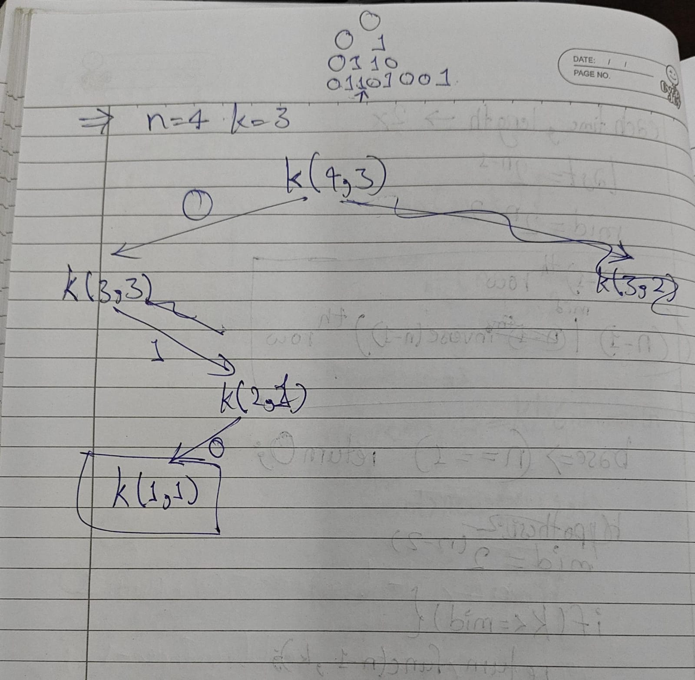
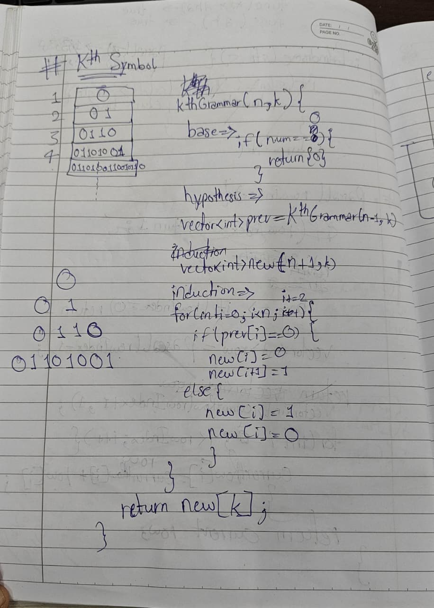
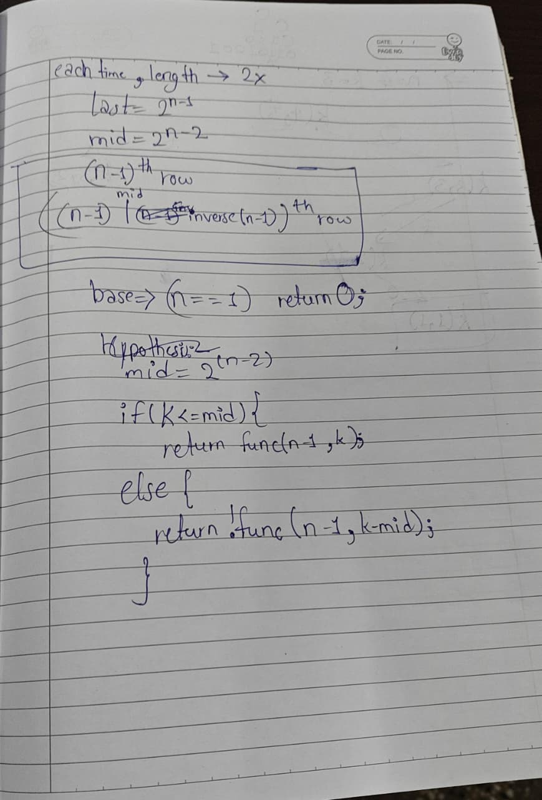

# 779 Kth Symbol in grammar

**Link:** [LeetCode](https://leetcode.com/problems/k-th-symbol-in-grammar/description/)  
**Difficulty:** Medium

## Approach
In this, using pure recursion is not good, because, at each upcoming row, the row length get's double. Row Length = 2^(n - 1).So, for 30th row, you can imagine 2^30 which will cause memory exceed error.
In this, we have used mathematics to avoid using vectors similar to pascal triangle. Last element is at 2^(n - 1) and middle element is at 2^(n - 2).
Now, we have t go to nth row and kth value in that row, we have used binary search. 
If the k gets lower or equal to mid, then simply, we know that k is on the left half, and we repeat the function towards the left half.
If the k gets greater than the mid, then we know, k is on the right half and we repeat the function towards the right and iverse the value because, we have found a pattern that left half is the original whole value above the current row and right half is the inverse of whole value above the current row.
At last when we get the base case, we get 0, and then accoridng to the conditions, since we have the position, we go from base case and move the value(not position now) to the final position and that's how we calculate the value and not generate each number till the nth row.

---

**Time Complexity:** O(N)  
**Space Complexity:** O(N)

## Key Learning
In earlier problems, if you needed to search an array, you physically built the array in memory and looped through it. This problem teaches you that if the data follows strict mathematical rules, you don't need to build it to search it.You effectively performed a Binary Search on a massive tree that didn't actually exist anywhere except in your algorithm's logic. By using math (K and mid) to act as a GPS, you navigated a "virtual" search space. This is a master-level optimization technique. Whenever an interviewer gives you a problem where the data grows exponentially (like 2^N), your first thought should now be: "Can I find the answer mathematically without actually generating the data?"