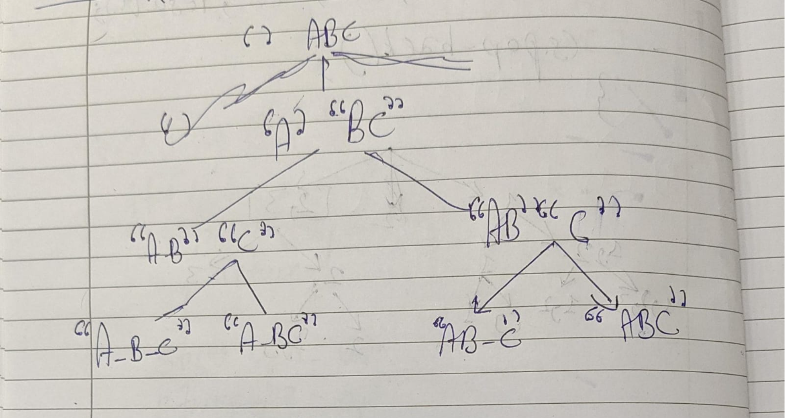
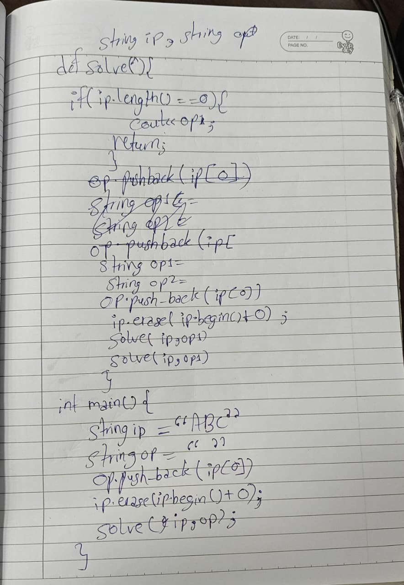

# Given a string "AB", now you have to transform character into upper case and print all the output having capital character at different location. Ex: ab, Ab, aB, AB.

## Approach
Since, here our first choice will be 

---

**Time Complexity:** O(2^n-1)  
**Space Complexity:** O(n)

## Key Learning
Build the tree with extreme care by analysing the conditions well, once the tree is built, the code will be the cake walk.